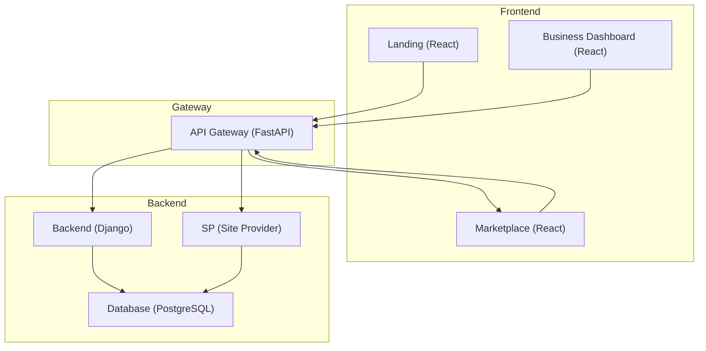

# eBezard Platform Architecture (Development)

Below is a high-level diagram and description of the new microservices architecture for the eBezard platform.

---

## Architecture Diagram

---

## Service Overview

- **Landing (React)**: Entry point for all users. Handles authentication, role selection, and onboarding. Communicates only with the API Gateway.
- **API Gateway (FastAPI)**: Central routing, authentication, and orchestration layer. Forwards requests to backend, marketplace, and site provider services.
- **Business Dashboard (React)**: Interface for business users to manage their stores. Communicates with the API Gateway.
- **Marketplace (React)**: Interface for customers to browse and interact with online stores. Communicates with the API Gateway.
- **Backend (Django)**: Handles business logic, user management, and data storage. Connects directly to the database.
- **SP (Site Provider)**: Manages platform-wide configuration, branding, and static content. Connects directly to the database.
- **Database (PostgreSQL)**: Central data storage for backend and site provider services.

---

## Request Flow Example

1. **User accesses Landing (React)**
2. **Landing sends authentication/registration request to API Gateway**
3. **API Gateway routes request to Backend (Django) or SP (Site Provider) as needed**
4. **After login, user is redirected to Business Dashboard or Marketplace based on role**
5. **All subsequent API requestsvvv from frontends go through API Gateway**

---

> **Note:** All service ports, environment variables, and dependencies are managed via Docker Compose and `.env